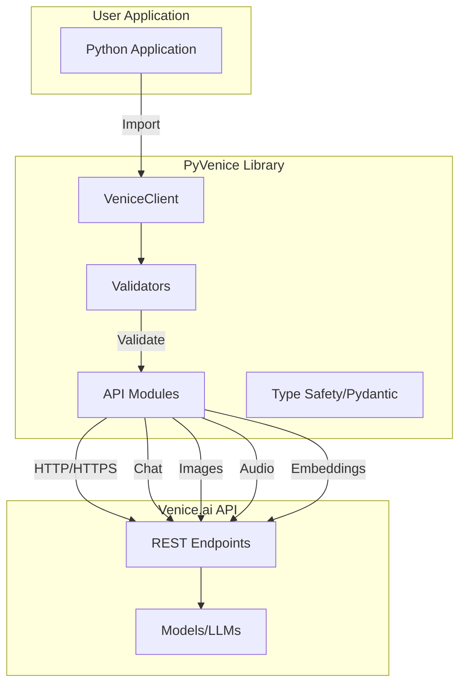
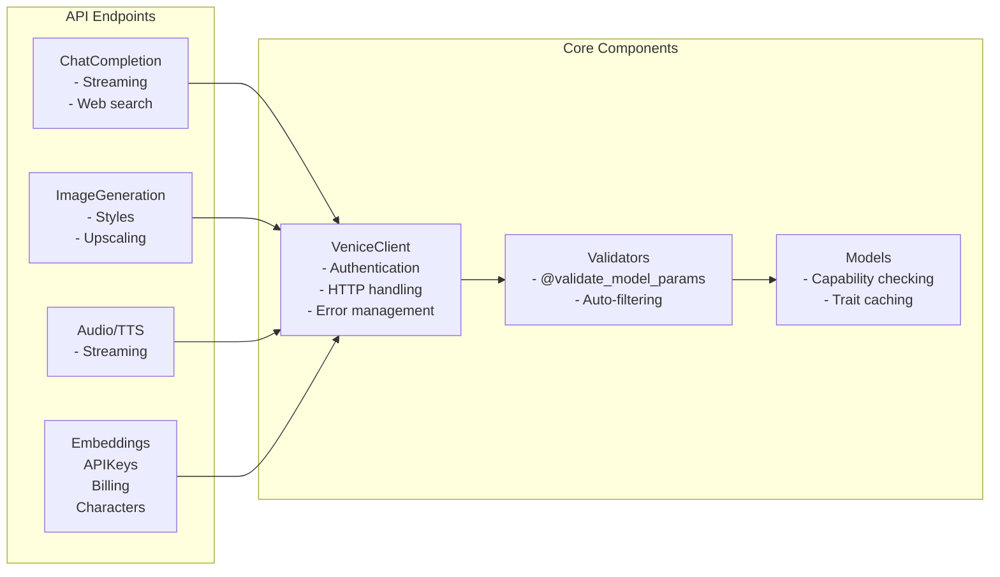
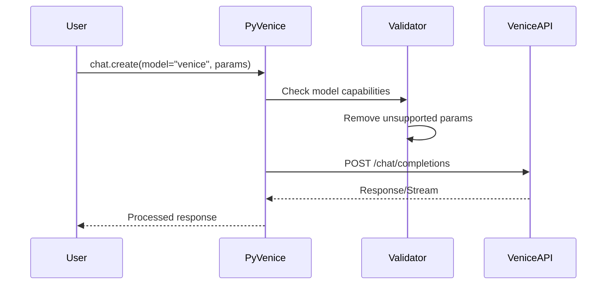

# PyVenice Architecture

## High-Level Architecture

```mermaid
graph TB
    subgraph "User Application"
        A[Python Application]
    end
    
    subgraph "PyVenice Library"
        B[VeniceClient]
        C[Validators]
        D[API Modules]
        E[Type Safety/Pydantic]
    end
    
    subgraph "Venice.ai API"
        F[REST Endpoints]
        G[Models/LLMs]
    end
    
    A -->|Import| B
    B --> C
    C -->|Validate| D
    D -->|HTTP/HTTPS| F
    F --> G
    
    D --> |Chat| F
    D --> |Images| F
    D --> |Audio| F
    D --> |Embeddings| F
```

## Component Architecture

```mermaid
graph LR
    subgraph "Core Components"
        Client[VeniceClient<br/>- Authentication<br/>- HTTP handling<br/>- Error management]
        Valid[Validators<br/>- @validate_model_params<br/>- Auto-filtering]
        Models[Models<br/>- Capability checking<br/>- Trait caching]
    end
    
    subgraph "API Endpoints"
        Chat[ChatCompletion<br/>- Streaming<br/>- Web search]
        Image[ImageGeneration<br/>- Styles<br/>- Upscaling]
        Audio[Audio/TTS<br/>- Streaming]
        Other[Embeddings<br/>APIKeys<br/>Billing<br/>Characters]
    end
    
    Client --> Valid
    Valid --> Models
    Chat --> Client
    Image --> Client
    Audio --> Client
    Other --> Client
```

## Request Flow

```mermaid
sequenceDiagram
    participant User
    participant PyVenice
    participant Validator
    participant VeniceAPI
    
    User->>PyVenice: chat.create(model="venice", params)
    PyVenice->>Validator: Check model capabilities
    Validator->>Validator: Remove unsupported params
    PyVenice->>VeniceAPI: POST /chat/completions
    VeniceAPI-->>PyVenice: Response/Stream
    PyVenice-->>User: Processed response
```